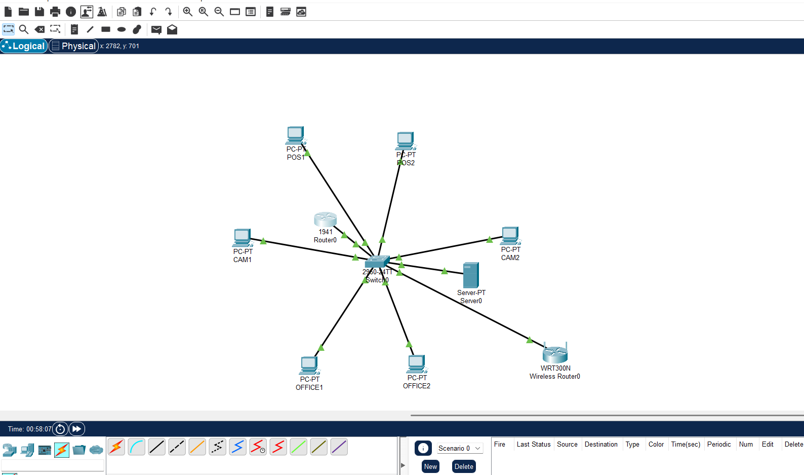
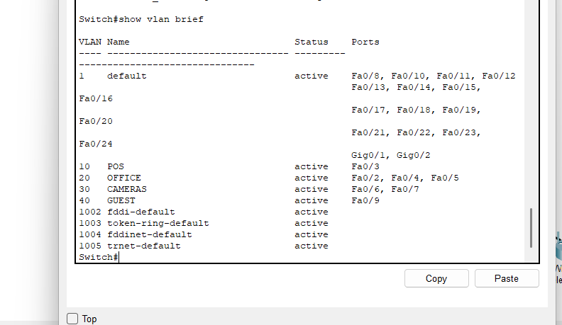
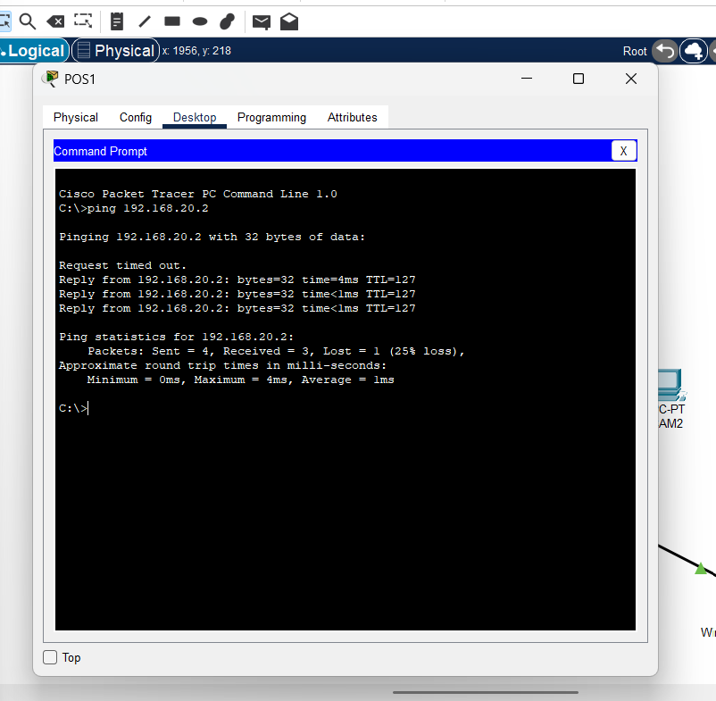
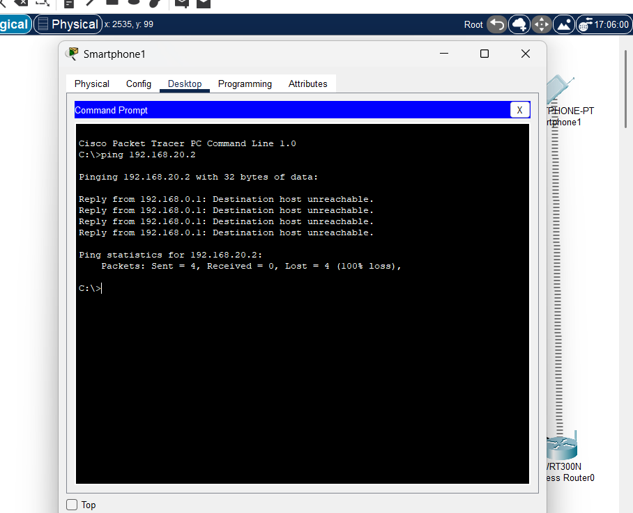
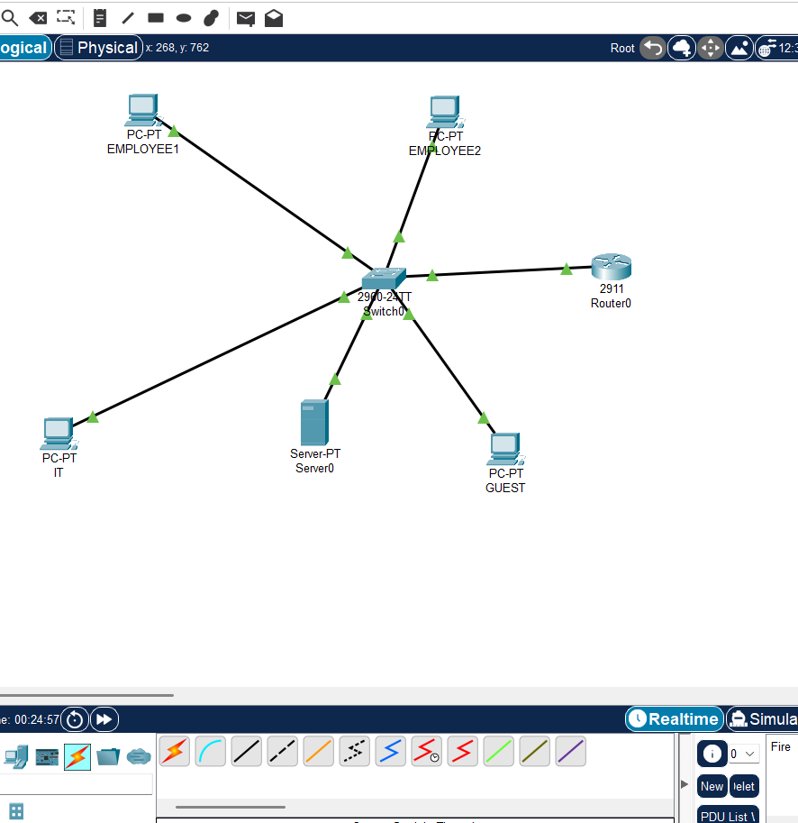
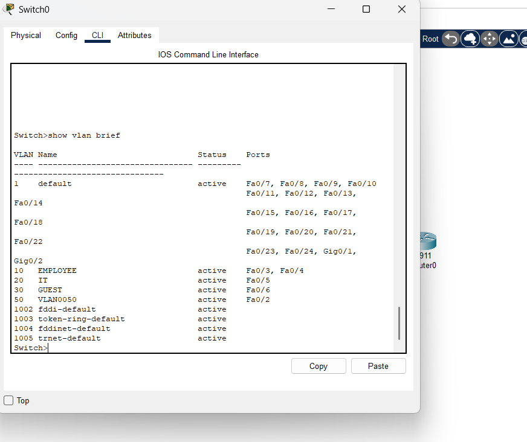
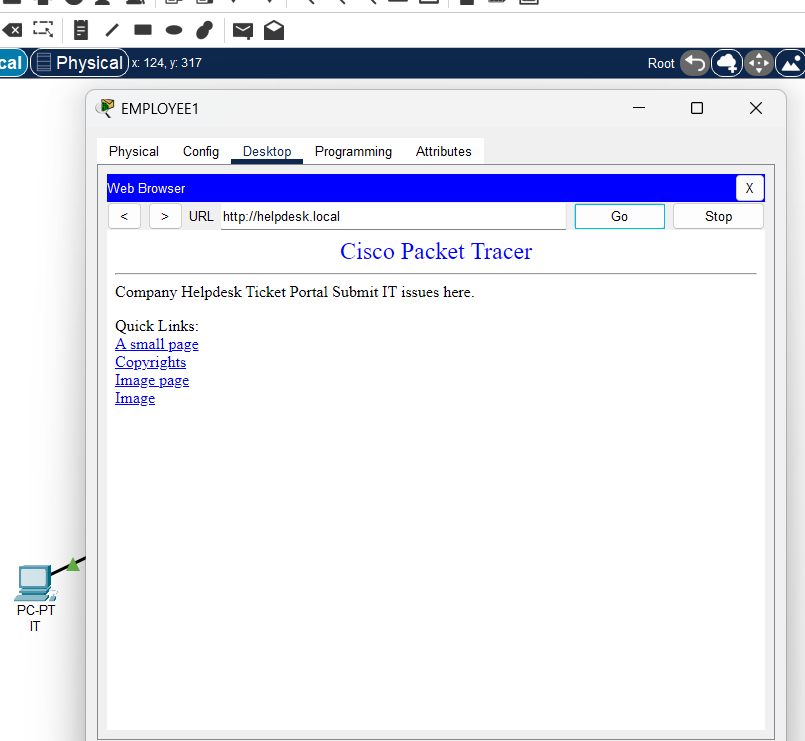
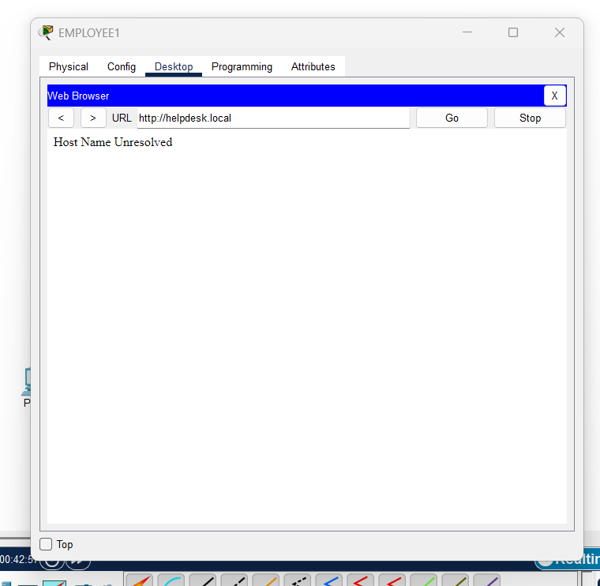
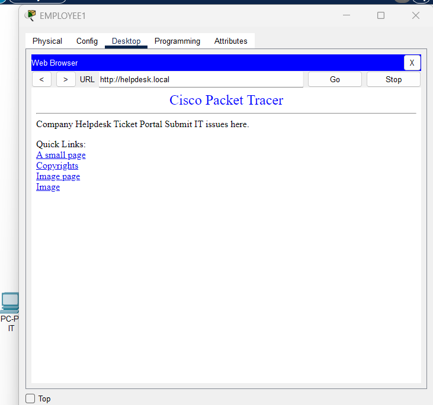

# 💼 Networking Portfolio — Akashdeep Singh

## 👨‍💻 About Me
I am an aspiring IT and Networking professional with hands-on experience through practical networking labs and live website development projects. I have built and tested real-world network designs using Cisco Packet Tracer, focusing on VLANs, routing, DHCP, ACL-based security, and troubleshooting. I have also developed and managed websites using WordPress, HTML, and CSS for small businesses and individuals.

While I may not yet have extensive formal industry experience, I am confident in my foundational skills and ready to start working, contribute to a team, and continue learning on the job. I am motivated, adaptable, and actively seeking an opportunity where I can grow and apply my skills in a real-world IT or networking environment.

---

## 🎯 Objective
Seeking an entry-level IT / Networking / Help Desk position where I can apply technical knowledge, grow professionally, and contribute to real-world infrastructure environments.
## 🛠 Technical Skills

**Networking**
- TCP/IP
- VLAN Configuration
- Routing & Switching
- Subnetting
- Network Troubleshooting

**Systems**
- Windows OS
- Basic Linux Administration
- Hardware Setup & Diagnostics

**Tools**
- Cisco Packet Tracer
- GitHub
- Command Line (CLI)

---

## 📂 Projects

⛽ Retail Gas Station Network (Simulated) — Secure VLAN Design
📌 Project Overview

-This project simulates a secure network design for a retail gas station environment. The network is segmented to isolate Point-of-Sale (POS) systems from Office systems, Security Cameras, and Guest Wi-Fi.

-The design focuses on protecting sensitive payment systems while allowing necessary internal communication and controlled guest access.

-The lab was built using Cisco Packet Tracer to demonstrate practical enterprise networking and security concepts.

🧱 Network Topology

Figure 1 – Retail Gas Station Network Topology

The network consists of:

-One router providing inter-VLAN routing

-One Layer-2 switch for access connectivity

-POS terminals, Office systems, and Camera devices

-A Guest Wi-Fi segment connected through a wireless router

🗂 VLAN Segmentation

Figure 2 – VLAN Segmentation and Port Assignment

VLANs were created to logically separate devices based on business function:

-VLAN	Purpose	Subnet
-10	POS	192.168.10.0/24
-20	Office	192.168.20.0/24
-30	Cameras	192.168.30.0/24
-40	Guest Wi-Fi	192.168.40.0/24

This segmentation reduces broadcast traffic and prevents unauthorized access between network zones.

🔁 Inter-VLAN Routing

Figure 3 – Inter-VLAN Connectivity Validation

Router-on-a-Stick was implemented using 802.1Q subinterfaces to enable controlled communication between VLANs.
Connectivity testing confirms that authorized internal networks (e.g., POS and Office) can communicate successfully.

🔐 Security Enforcement (ACL)

Figure 4 – Guest Network Access Blocked from POS

An Access Control List (ACL) was applied to the Guest VLAN to block access to POS systems.

Security Policy:

-Guest Wi-Fi users must not access POS devices

-POS systems remain isolated from public traffic

-Testing confirms that Guest devices are unable to reach POS systems, validating correct ACL enforcement.

🔒 Switch Port Security

Port security was enabled on POS switch ports to restrict unauthorized device access.
This prevents rogue devices from being connected to critical payment infrastructure.

---

🧠 Skills Demonstrated

-VLAN creation and port assignment

-Trunking and Router-on-a-Stick

-Inter-VLAN routing verification

-DHCP configuration across multiple VLANs

-ACL-based network security

-Endpoint protection using switch port security

-Business-driven network design for retail environments

🔚 Conclusion

This project demonstrates the design and validation of a secure, segmented retail network focused on protecting POS systems from unauthorized access.

---
### 🔹 Help Desk Troubleshooting Simulation
🏢 Segmented Helpdesk Network (Cisco Packet Tracer)
📌 Project Summary

Designed and implemented a small enterprise-style office network with a centralized Helpdesk web service.
The network is segmented using VLANs and secured with access control policies to separate Employees, IT Support, Guests, and Servers.

This project demonstrates practical networking, security, and troubleshooting skills using Cisco Packet Tracer.

🧱 Network Design

The network includes:

-Router-on-a-Stick for inter-VLAN routing

-Layer-2 switch with multiple VLANs

-Internal DNS and HTTP server

-Employee, IT, and Guest user networks

*Figure 1 – Segmented Helpdesk Network Topology*

🗂 VLAN Architecture
VLAN	Role	Subnet
10	Employee	192.168.10.0/24
20	IT Support	192.168.20.0/24
30	Guest	192.168.30.0/24
50	Server	192.168.50.0/24

VLAN segmentation improves security and limits unnecessary network access between departments.

*Figure 2 – VLAN Segmentation and Port Assignment*

🌐 Core Services

-DHCP: Centralized IP assignment for all VLANs

-DNS: Internal name resolution (helpdesk.local)

-HTTP: Internal Helpdesk web portal hosted on the server

-Employees and IT staff can access the helpdesk portal using a domain name instead of an IP address.

*Figure 3 – Employee Access to Helpdesk Portal via Domain Name*

🔐 Security Controls

An ACL was implemented to block Guest VLAN access to the Server VLAN while allowing internal users to reach business services.

This simulates real-world guest network isolation commonly used in enterprise environments.

🛠 Troubleshooting Scenario

A simulated DNS failure was introduced by removing the DNS record for the helpdesk portal.

Diagnosis:

-Server reachable by IP

-Web service running

-Name resolution failed

*Figure 4 – Simulated DNS Resolution Failure*

Resolution:
The DNS record was restored, immediately recovering access.

*Figure 5 – Helpdesk Portal Accessible via IP Address After Troubleshooting*
---
🧠 Skills Demonstrated

-VLAN configuration and segmentation

-Inter-VLAN routing (Router-on-a-Stick)

-DHCP and DNS services

-Web server hosting

-ACL-based security

-Network troubleshooting and root-cause analysis

🔚 Conclusion

This project demonstrates the ability to design, secure, and troubleshoot a segmented enterprise network while supporting internal business services.
The lab reflects real-world scenarios relevant to IT Support and Junior Network Administrator roles.

---
---

🌐 Web Development & Website Management Projects
---

1️⃣ Washing Go Detailing

 https://washngodetailing.ca

Role: Website Designer & Manager
Technologies: WordPress, HTML, CSS, SEO

Description:

Designed and deployed a responsive business website for an automotive detailing service.

Implemented service pages, contact forms, and mobile-friendly layouts to improve customer engagement.

Optimized on-page SEO to enhance local search visibility.

Ensured website security, performance optimization, and ongoing maintenance.

2️⃣ Serene Studioz

 https://serenestudioz.com

Role: Website Developer
Technologies: WordPress, HTML, CSS

Description:

Developed a modern website for a creative studio, focusing on clean design and brand consistency.

Structured content to showcase services, portfolio, and contact information.

Ensured cross-device compatibility and smooth user navigation.

Assisted with domain setup and website deployment.

3️⃣ Zander Gill

  https://zandergill.com

Role: Web Developer
Technologies: WordPress, HTML, CSS

Description:

Built a personal portfolio website to highlight professional work and online presence.

Customized layouts and styling to reflect the client’s personal brand.

Implemented responsive design for desktop and mobile users.

Provided basic SEO optimization and performance tuning.
Note: some parts are not ready yet but can be done once I will get response for the client

---

🧠 Skills Demonstrated

-Website Design & Deployment

-WordPress Development & Customization

-HTML & CSS

-SEO Optimization (On-page)

-Responsive Design

-Website Security & Maintenance

-Client-focused Requirements Gathering

---

## 📫 Contact
- Email: akashdeepsinghjgn15@gmail.com
- Phone: 437-833-3515

